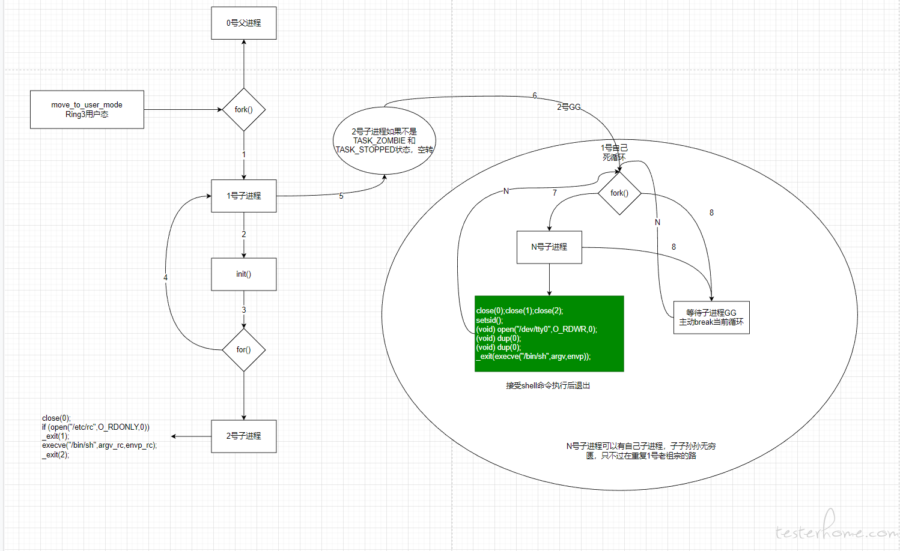

以linux0.11为源码，几句话说清楚。
1、操作系统启动完成各种资源的初始化
2、手动构建了一个0号进程
3、0号进程切到用户态fork出1号子进程
4、1号子进程执行init()函数
5、1号进程套了2个while循环，1号子进程在第一层while循环中fork子进程，该进程接受用户输入并执行命令后退出，然后在第二层while循环中持续等待子进程GG态后break。
6、5号过程循环嵌套，N号子进程可以有自己子进程，子子孙孙无穷匮，只不过在重复1号老祖宗的路。

main.c 文件的主入口
```C
void main(void)		/* This really IS void, no error here. */
{	
   //资源初始化，不管		
	mem_init(main_memory_start,memory_end);
	trap_init();
	blk_dev_init();
	chr_dev_init();
	tty_init();
	time_init();
	sched_init();
	buffer_init(buffer_memory_end);
	hd_init();
	floppy_init();
	sti();
       //强制使用内联汇编将手动初始化的0号进程切换特权级到用户态
	move_to_user_mode();
	//子进程，fork函数返回0则是子进程，否则就是父进程拿到了子进程的pid
  //C语言中0标识false
	if (!fork()) {		/* we count on this going ok */
                //子进程执行了init
		init();
	}
/*
 *   NOTE!!   For any other task 'pause()' would mean we have to get a
 * signal to awaken, but task0 is the sole exception (see 'schedule()')
 * as task 0 gets activated at every idle moment (when no other tasks
 * can run). For task0 'pause()' just means we go check if some other
 * task can run, and if not we return here.
 */
	for(;;) pause();
}
```
init(）函数
```C
void init(void)
{
	int pid,i;

	setup((void *) &drive_info);
	(void) open("/dev/tty0",O_RDWR,0);
	(void) dup(0);
	(void) dup(0);
	printf("%d buffers = %d bytes buffer space\n\r",NR_BUFFERS,
		NR_BUFFERS*BLOCK_SIZE);
	printf("Free mem: %d bytes\n\r",memory_end-main_memory_start);
	//子进程
	if (!(pid=fork())) {
		close(0);
		if (open("/etc/rc",O_RDONLY,0))
			_exit(1);
		execve("/bin/sh",argv_rc,envp_rc);
		_exit(2);
	}
	//父进程
	if (pid>0)
		//子进程如果不是TASK_ZOMBIE 和TASK_STOPPED状态，空转
		while (pid != wait(&i))
			/* nothing */;
	while (1) {
		if ((pid=fork())<0) {
			printf("Fork failed in init\r\n");
			continue;
		}
		if (!pid) {
			close(0);close(1);close(2);
			setsid();
			(void) open("/dev/tty0",O_RDWR,0);
			(void) dup(0);
			(void) dup(0);
			_exit(execve("/bin/sh",argv,envp));
		}
		while (1)
			if (pid == wait(&i))
				break;
		printf("\n\rchild %d died with code %04x\n\r",pid,i);
		sync();
	}
	_exit(0);	/* NOTE! _exit, not exit() */
}

```


本文首次发布于：

https://testerhome.com/topics/34085
